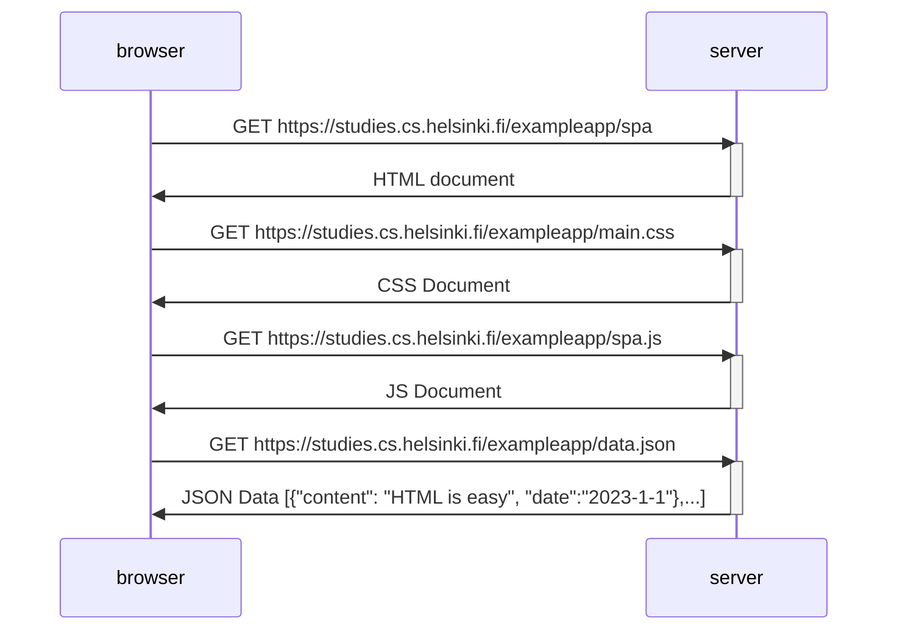

```mermaid
sequenceDiagram
    participant browser
    participant server
%% initial starup for browser
    browser ->>server: GET https://studies.cs.helsinki.fi/exampleapp/spa
    activate server
    server ->>browser: HTML document
    deactivate server

    browser ->>server: GET https://studies.cs.helsinki.fi/exampleapp/main.css
    activate server;
    server ->>browser: CSS Document
    deactivate server

    browser ->>server: GET https://studies.cs.helsinki.fi/exampleapp/spa.js
    activate server
    server ->>browser: JS Document
    deactivate server

    browser ->>server: GET https://studies.cs.helsinki.fi/exampleapp/data.json
    activate server
    server ->>browser: JSON Data [{"content": "HTML is easy", "date":"2023-1-1"},...]
    deactivate server

    %%similar page startup as first example, with HTML, CSS, and JS files loaded in sequentially as the requests are made
```
