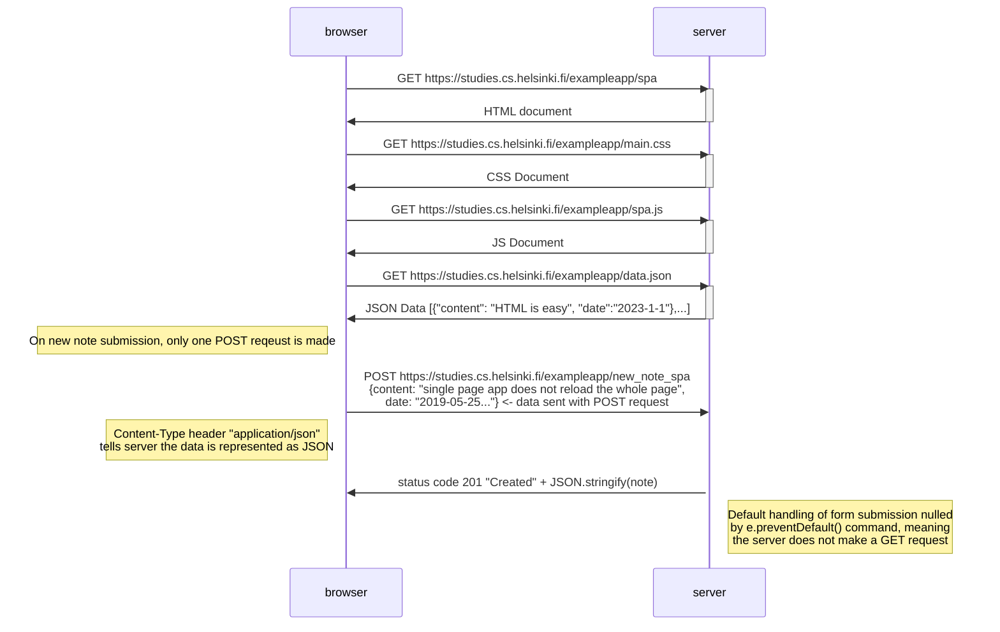

```mermaid
sequenceDiagram
    participant browser
    participant server
%% initial startup for browser
    browser ->>server: GET https://studies.cs.helsinki.fi/exampleapp/spa
    activate server
    server ->>browser: HTML document
    deactivate server

    browser ->>server: GET https://studies.cs.helsinki.fi/exampleapp/main.css
    activate server;
    server ->>browser: CSS Document
    deactivate server

    browser ->>server: GET https://studies.cs.helsinki.fi/exampleapp/spa.js
    activate server
    server ->>browser: JS Document
    deactivate server

    browser ->>server: GET https://studies.cs.helsinki.fi/exampleapp/data.json
    activate server
    server ->>browser: JSON Data [{"content": "HTML is easy", "date":"2023-1-1"},...]
    deactivate server

    %%similar page startup as first example, with HTML, CSS, and JS files loaded in sequentially as the requests are made

    Note left of browser: On new note submission, only one POST reqeust is made
    browser ->>server: POST https://studies.cs.helsinki.fi/exampleapp/new_note_spa <br/> {content: "single page app does not reload the whole page", <br/> date: "2019-05-25..."} <- data sent with POST request

    %% Without the Content-Type header the server would not know how to parse the data
    Note left of browser: Content-Type header "application/json" <br/> tells server the data is represented as JSON
    activate server
    server ->>browser: status code 201 "Created" + JSON.stringify(note)

    Note right of server: Default handling of form submission nulled <br/> by e.preventDefault() command, meaning <br/> the server does not make a GET request

```
