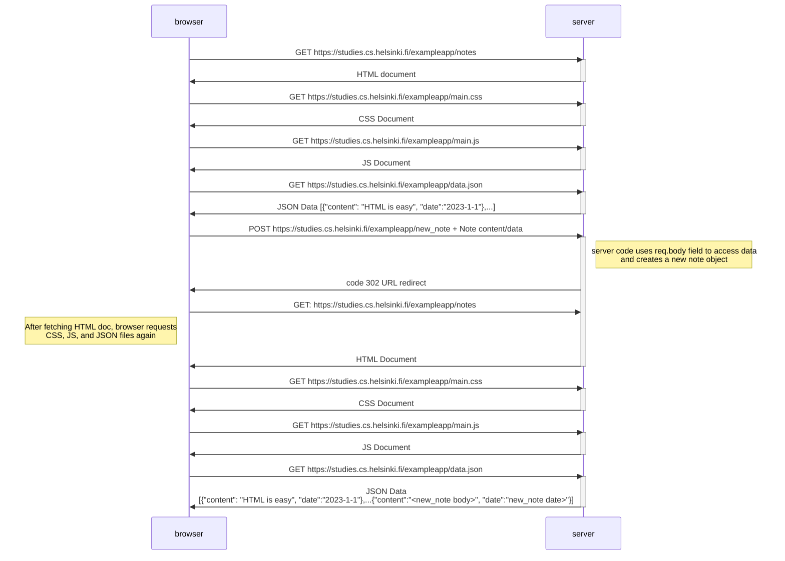

```mermaid
sequenceDiagram
    participant browser
    participant server

    browser ->>server: GET https://studies.cs.helsinki.fi/exampleapp/notes
    activate server
    server ->>browser: HTML document
    deactivate server

    browser ->>server: GET https://studies.cs.helsinki.fi/exampleapp/main.css
    activate server;
    server ->>browser: CSS Document
    deactivate server

    browser ->>server: GET https://studies.cs.helsinki.fi/exampleapp/main.js
    activate server
    server ->>browser: JS Document
    deactivate server

    browser ->>server: GET https://studies.cs.helsinki.fi/exampleapp/data.json
    activate server
    server ->>browser: JSON Data [{"content": "HTML is easy", "date":"2023-1-1"},...]
    deactivate server

    browser ->>server: POST https://studies.cs.helsinki.fi/exampleapp/new_note + Note content/data
    activate server
        Note right of server: server code uses req.body field to access data <br/> and creates a new note object
    server ->>browser: code 302 URL redirect
    browser ->>server: GET: https://studies.cs.helsinki.fi/exampleapp/notes
        Note left of browser: After fetching HTML doc, browser requests <br/> CSS, JS, and JSON files again
    server ->>browser: HTML Document
    deactivate server

    browser ->>server: GET https://studies.cs.helsinki.fi/exampleapp/main.css
    activate server;
    server ->>browser: CSS Document
    deactivate server

    browser ->>server: GET https://studies.cs.helsinki.fi/exampleapp/main.js
    activate server
    server ->>browser: JS Document
    deactivate server

    browser ->>server: GET https://studies.cs.helsinki.fi/exampleapp/data.json
    activate server
    server ->>browser: JSON Data <br/> [{"content": "HTML is easy", "date":"2023-1-1"},...{"content":"<new_note body>", "date":"new_note date>"}]
    deactivate server


```
